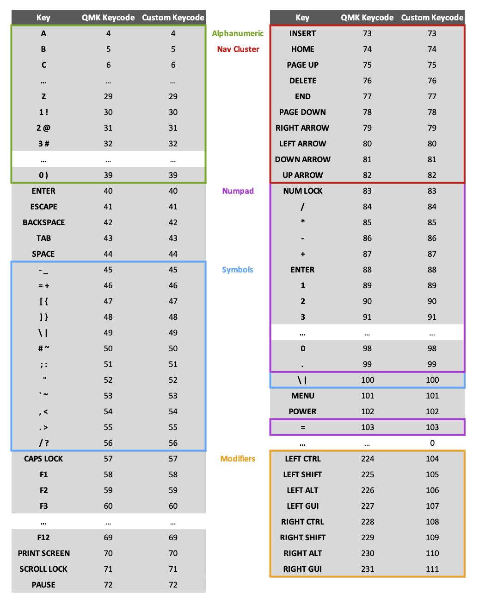

Malicious QMK
--------------

## DISCLAIMER!!!

This project contains code which has the ability to record and transmit sensitive information without a user's consent. It exists as a **proof-of-concept only** and a user should **never** use this unless they have a full understanding of what this firmware can do.

## Summary

This is a modified version of the popular QMK keyboard firmware which contains malicious code that logs the user's keystrokes, then implements a [rubber ducky](https://www.linux.org/threads/usb-rubber-ducky.4464/) style attack to open a network connection and send the keylogged data to a remote machine by sending a series of keystrokes to the user's computer.

This is a fork of the existing [QMK repo](https://github.com/qmk/qmk_firmware) and the QMK readme is renamed as `qmk_readme.md`

## Features

### Firmware Keylogger

Malicious QMK records up to 2048 key events, generated by the user typing into the infected keyboard. A *key event* is the action of either pressing or releasing a key, so this effectively means that up to 1024 characters can be saved at any time.

#### Logging Details

These key events are stored in the internal SRAM of the on-board microcontroller. This has only been tested on a [DZ60 PCB](https://kbdfans.com/products/dz60-60-pcb) which contains an [ATmega32U4 microcontroller](https://www.microchip.com/wwwproducts/en/ATmega32U4) with 2.5kB of SRAM. Other PCBs with different microcontrollers may have differently sized memories so may be able to store more or less key events.

In order to maximise the number of key events that can be recorded, only a subset of keys are recorded. This includes every key on a standard US ANSI 104-key keyboard with a few extras. Keys which are not recorded include special QMK keys which perform functions such as layer changes, modifying the RGB backlight settings and changing audio levels.

There is a total of 107 distinct keys that can be recorded as key events which can be encoded in 7 binary bits. Another single binary bit is used to indicate whether the key event was a press or a release, meaning that every keypress can be stored in a single byte of memory.

Since QMK has more than 127 distinct keycodes and some of the desired keys to be recorded are encoded as a number larger than 127, those keycodes need to be represented as a different number when stored in memory. When being replayed, they will need to be translated back into the QMK keycode.

Fortunately, only the left and right modifier keys need to have their keycodes changed which can be done dynamically be adding or subtracting an offset such that the internal keycodes for these keys follow on from the keycodes less than 127.

The following table shows every key which can be recorded, along with both its QMK and internal keycode mapping:

#### Replaying Logged Keys

A special custom keycode has been created whose sole purpose is to replay all logged key events back to the connected computer as typed keys.

This keycode (named `DUMP`) will read through the array of recorded key events and cause them to be replayed in typing order. This preserves all typed symbols, capitalised letters and even key combinations which were performed (such as Alt-F4 or Command-Q).

However, since no timing information is stored, each keypress will correspond to a single typed character, even if that key was actually held down and generated multiple characters when actually typed by the user.

#### More than 2048 Key Events??

As mentioned previously, only 2kB of SRAM memory is allocated for logging key events. If the user generates more than 2048 key events, the current strategy is to keep the most recent events and overwrite those furthest away in time.

### Remote Transmission

*coming soon*

### Sensitive Data Detection & Prioritisation

*coming soon*
